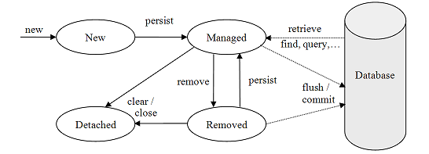

# OrangeTalents-JPA-e-Hibernate

### Modulo 1 - Sobre a Java Persistence API(JPA)

Como é feito a persistência de dados sem usar JPA?
* especificação JDBC - possibilita o reuso de código para nos conectarmos com qualquer banco de dados geracional

O que é JPA? Hibernate?
* JPA é um ORM (Object Relacional Mapper) Java;
	* um ORM mapeia as classes para tabelas e gera o SQL de forma automática;
* JPA é uma especificação no mundo Java que cuida do papel de persistência com mapeamento-objeto-relacional. 
* Hibernate é a a implementação de referência do JPA;
* para inicializar a JPA, é preciso definir um arquivo de configuração, chamado de persistence.xml
	* nesse arquivo está todas as configurações que precisamos dentro de uma unidade de persistência para acessarmos o banco;
* podemos usar JPA para gerar e atualizar as tabelas no banco de dados;
* EntityManager - Interface JPA, por meio dela podemos abstrair o mundo relacional e focar apenas em objetos;
* através da classe Persistence é possível lê as configurações do arquivo persistence.xml e então criar uma EntitiManagerFactory;
* toda entidade deve possuir a annotation @Entity e possuir um identificador anotado como @Id;

### Modulo 2 - Usando EntityManager

* Transações - é um conjunto de operações que executam de forma atômica, e  são criadas e gerenciadas pelos SGBD's;
* Estados de objetos com relação ao jpa
	* managed - gerenciado pela JPA, existe uma sincronização dos dados.
		* ao fazer um find, o  JPA ainda terá uma referencia para o objeto devolvido;
		* assim, quando alterarmos algum atributo desse objeto e fazermos o commit, haverá uma sincronização automática;
		* possui id;
	* detached - não é gerenciado pelo JPA, não há sincronização com os dados.
		* podemos ver esse estado quando fechamos a conexão com o EntityManager, após essa conexão ser fechada toda a alteração que é realizada com o objeto em questão ela não é refletida no banco;
		* para refletir alterações realizadas depois de fechar uma conexão com o EntityManager, é necessário criar outro EntityManager (e então volta para o estado managed) e aplicar alterações usando um merge;
		* possui id;
	* transiente - não possui representação no banco de dados, nem o EntityManager o conhece;
		* não possui id;
	* removed - objeto conhecido pelo EntityManage, e que foi deletado no banco de dados;
		* não possui registro no banco, pois acabou de ser removido;
		* possui id;

### Módulo 3 - Mapeando relacionamentos

* em bancos relacionais existem relacionamentos entre tabelas, então precisamos da mesma forma representar estes relacionamentos entre os objetos ;
* com JPA é possível fazer isso através de anotações;
* no nosso exemplo uma conta pode ter várias movimentações, ou seja, um relacionamento de um para muitos;
	* dessa forma, na classe Movimentacao, no atributo do tipo Conta iremos anotar com @ManyToOne;
	* no banco esse relacionamento ficará representado na tabela de movimentacao por uma coluna id_conta (chave estrangeira para a tabela conta);
* os relacionamentos podem ser unidirecional (só pode ser identificado de um dos lados) e bidirecional (pode ser identificado dos dois lados);
* @ManyToMany - relacionamento entre duas entidades que relacionam-se entre si de forma múltipla, ou seja, a entidade A possui várias entidades B, assim como a entidade B possui várias entidades A;
	* nesse tipo de relacionamento, assim como no mundo relacional, é criado uma tabela de relacionamento;
* @OneToMany - relacionamento entre duas entidades em que a entidade A possui várias entidades B, porém a entidade B não possui várias entidades A;
* @OneToOne - relacionamento entre duas entidades em que a entidade A possui apenas uma entidade B, assim como a entidade B possui apenas uma entidade A;

Módulo 4 - Relacionamento para muitos
* para categorizar as movimentações - uma movimentação pode ter várias categorias, criamos um atributo dentro de Movimentacao que é uma lista de Categoria, e então:
	* podemos colocar a anotação @OnyToMany, mas dessa forma essas categorias só poderiam pertencer a uma determinada movimentação, e não queremos isso;
	*  ou podemos colocar a anotação @ManyToMany, então as categorias cadastradas para uma movimentação A poderá ser reutilizada para uma movimentação B;

Módulo 5 - Pesquisando com JPQL(Java Persistence Query Language)
* JPQL é feita para abstrair o mundo relacional, permitindo assim que nos preocupamos apenas com objetos;
* após criar uma string com a query, é necessário usar o EntityManager e chamar o método createQuery();
* podemos pegar o resultado da query através do getResultList();
* para passar parâmetros dentro da string que representa a query:
	* dentro da string colocamos ":<variavel>", ex: "select m from Movimentacao m where m.conta = :pConta";
	* utiliza o método getParameter(), passando o nome do parâmetro e o valor do mesmo;
	
